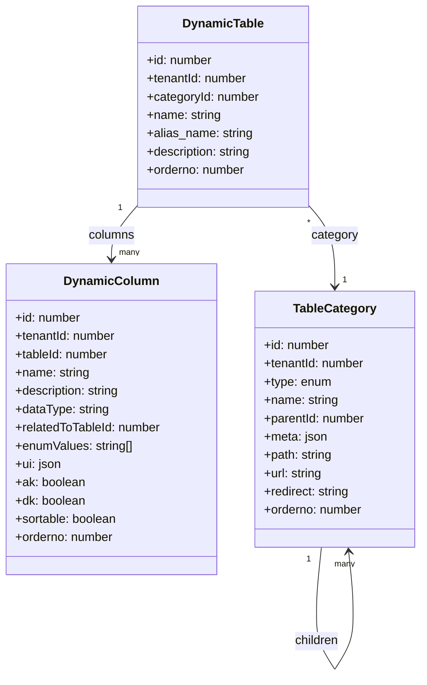
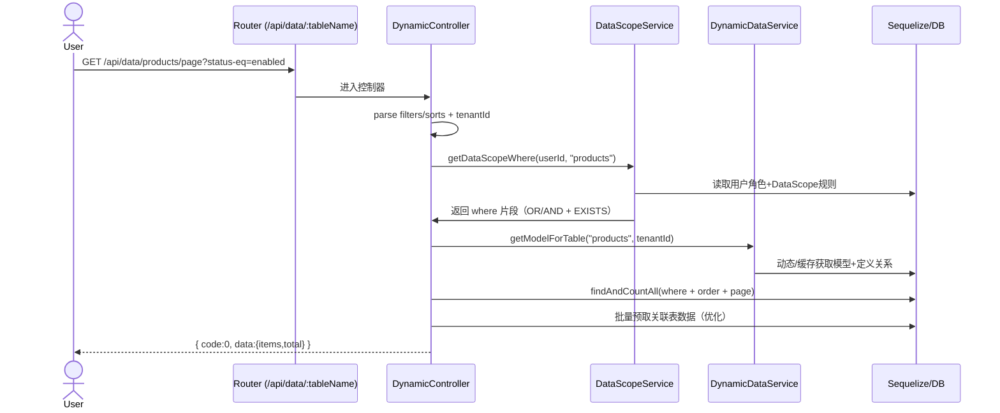
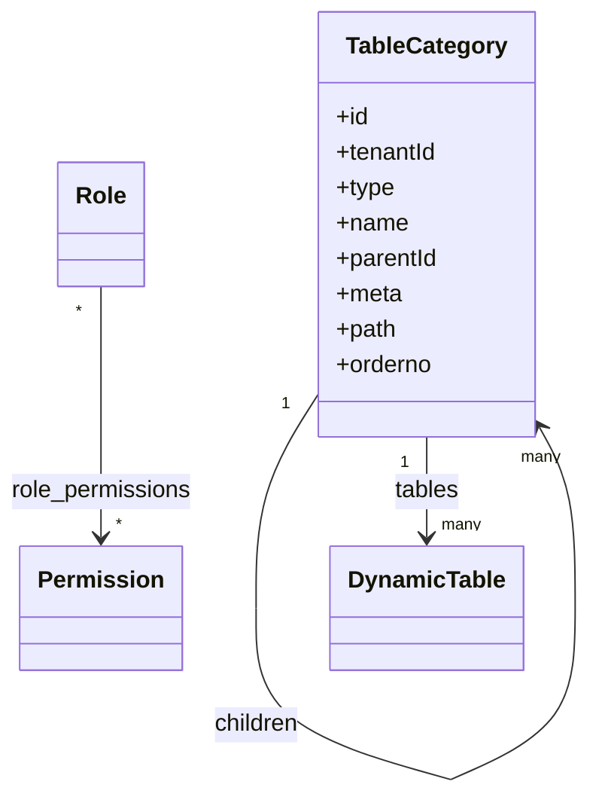
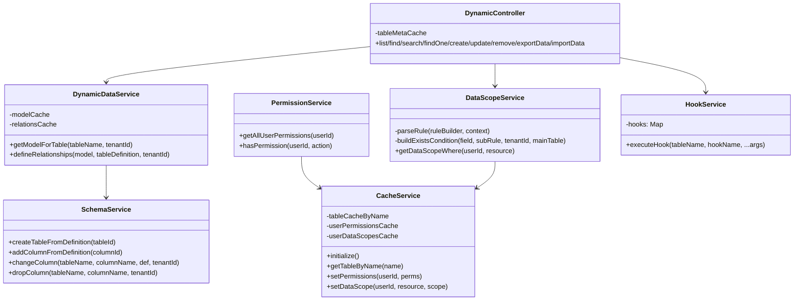

# Node Express Demo（后端）README

本项目提供一套“低代码/元数据驱动”的后端能力，围绕动态表、动态接口、菜单控制与数据权限体系四大核心模块构建，支持快速定义业务模型、自动生成接口、精细化权限管控、以及前端动态渲染。

本文重点说明：
1) 动态表字段配置系统（字段定义、类型映射、校验规则和动态渲染逻辑）
2) 动态接口功能（接口自动注册、参数解析、权限校验和执行流程）
3) 菜单控制系统（多级菜单结构、权限绑定和动态加载机制）
4) 数据权限体系（行级/列级权限控制、数据过滤策略和权限继承关系）
并结合 src 目录下现有实现给出示例与 Mermaid UML 图，最后附“业务功能开发步骤与示例”。

目录
- 一、项目结构与运行
- 二、核心模块一：动态表字段配置系统
- 三、核心模块二：动态接口功能
- 四、核心模块三：菜单控制系统
- 五、核心模块四：数据权限体系
- 六、业务功能开发步骤与示例
- 七、附录：关键类关系与时序（Mermaid）


一、项目结构与运行
- 主要目录
  - src/db/models：Sequelize 模型（DynamicTable/DynamicColumn/TableCategory/Role/Permission/DataScope 等）
  - src/services：业务服务（DynamicDataService/SchemaService/DataScopeService/PermissionService/HookService/CacheService 等）
  - src/api：控制器（动态数据控制器 DynamicController 等）
  - src/router：中间件与统一响应（auth/permission/log 等）
  - src/index.ts：启动/初始化流程（模型同步、系统数据初始化、缓存预热、路由加载）
- 运行（开发）
  - 配置数据库、环境变量
  - 执行启动脚本（例如 pnpm dev / npm run dev），默认监听 80 端口


二、核心模块一：动态表字段配置系统

2.1 数据模型（与字段定义）
- DynamicTable（src/db/models/DynamicTable.ts）
  - name（物理表名）、alias_name（业务别名）、description、tenantId、categoryId（挂载菜单/分类）、orderno
- DynamicColumn（src/db/models/DynamicColumn.ts）
  - tableId（所属表）、name（物理字段名）、description、dataType、relatedToTableId（关系字段指向表ID）
  - enumValues（枚举型）、ui（UI渲染配置）、ak（检索键）、dk（显示键）、sortable、orderno
- 关联（src/db/models/associations.ts）
  - DynamicTable.hasMany(DynamicColumn, as: 'columns')
  - TableCategory 自关联（实现层级结构），DynamicTable.belongsTo(TableCategory, as: 'category')

示例（创建一张“产品”动态表与字段）
```typescript
// 伪代码：使用 Sequelize API 创建元数据（可在初始化脚本/管理后台执行）
const table = await DynamicTable.create({
  tenantId: 1,
  name: 'products',
  alias_name: 'products',
  description: '产品主数据',
});
await DynamicColumn.bulkCreate([
  { tenantId: 1, tableId: table.id, name: 'code', description: '产品编码', dataType: 'STRING', ak: true, sortable: true },
  { tenantId: 1, tableId: table.id, name: 'name', description: '产品名称', dataType: 'STRING', dk: true },
  { tenantId: 1, tableId: table.id, name: 'price', description: '含税价', dataType: 'DECIMAL' },
  { tenantId: 1, tableId: table.id, name: 'status', description: '状态', dataType: 'ENUM', enumValues: ['enabled','disabled'] },
]);
```

2.2 类型映射
- 运行期模型生成：src/services/DynamicDataService.ts
  - getModelForTable(tableName, tenantId)：根据 DynamicTable/DynamicColumn 生成 Sequelize Model
  - getSequelizeAttributes：将 dataType 映射到 Sequelize DataTypes
  - 关系定义：当字段标注为关系（RELATIONSHIP 或 ID + relatedToTableId）时，自动 belongsTo 关联
- 特殊类型（ColumnDataTypes）
  - ID/DOCNO/DATENUMBER/QTY/AMT 等按约定映射（详见 mapDataType）

片段（mapDataType）
```typescript
switch (dataType.toUpperCase()) {
  case ColumnDataTypes.ID: return DataTypes.INTEGER;
  case ColumnDataTypes.DOCNO: return DataTypes.STRING;
  case ColumnDataTypes.DATENUMBER: return DataTypes.INTEGER;
  case ColumnDataTypes.QTY: return DataTypes.INTEGER;
  case ColumnDataTypes.AMT: return DataTypes.DECIMAL;
  default: 
    // 回退到 Sequelize 原生类型名（如 STRING/INTEGER/DECIMAL/DATE/BOOLEAN...）
}
```

2.3 物理表生成与变更
- SchemaService（src/services/SchemaService.ts）
  - createTableFromDefinition(tableId)：根据 DynamicTable/DynamicColumn 创建物理表
  - addColumnFromDefinition/changeColumn/dropColumn：按字段定义变更物理结构
- 启动期校验（src/index.ts）
  - initDynamicTables：发现缺失物理表则调用 SchemaService 创建

2.4 校验规则与动态渲染
- 校验规则
  - DB 层：可通过 Sequelize 字段属性与数据库约束（allowNull/unique/index…）
  - 业务层：可在 HookService 中实现 beforeCreate/beforeUpdate 规则（src/services/HookService.ts）
- 动态渲染
  - 字段 ui JSON（DynamicColumn.ui）承载表单/表格渲染元数据（组件类型、占位符、校验提示、字典等）
  - getTableConfig(tableName)（在 DynamicController 中调用）用于汇集表/字段/渲染元数据，前端据此动态生成页面
  - ak/dk：ak 作为检索字段（search 接口），dk 作为显示字段（下拉 name 显示）

示例（字段 UI 配置）
```json
{
  "fieldName": "status",
  "component": "Select",
  "props": { "options": [{"label":"启用","value":"enabled"},{"label":"停用","value":"disabled"}] },
  "rules": [{ "required": true, "message": "请选择状态" }]
}
```

2.5 Mermaid 类图（动态表与字段）



三、核心模块二：动态接口功能

3.1 自动注册与路由定义
- 自动装载：src/index.ts 使用 RouteLoader 扫描 src/api，统一挂在 /api
- 路由装饰器：src/api/DynamicController.ts 使用 @Controller/@Get/@Post 等装饰器（utils/routeDecorators）
- 控制器：DynamicController 在 /data/:tableName 下提供 CRUD、分页、搜索、导入导出等接口

3.2 参数解析与查询构造
- 过滤：getParsedWhere 支持 eq/ne/gte/gt/lte/lt/in/notIn/like/iLike 等（通过 req.query，如 status-eq=enabled）
- 排序：sorts=field1-ASC,field2-DESC
- 分页：/page（page/pageSize）
- 搜索：/search 使用 ak 作为关键词字段，dk 作为展示字段

片段（src/api/DynamicController.ts）
```typescript
@Get("/page", [checkPermission('data::tableName:page')])
async find(req, res) {
  const { page=1, pageSize=10, sorts, ...filters } = req.query;
  const where = await this.getParsedWhere(req, filters); // 合并租户与数据权限
  const order = this.getParsedSorts(sorts);
  const Model = await DynamicDataService.getModelForTable(tableName, req.user.tenantId);
  const { count, rows } = await Model.findAndCountAll({ where, order, limit, offset });
  // 手动填充关联字段（批量预取，见 populateRelatedData）
  return ok({ items: populatedData, total: count });
}
```

3.3 权限校验
- 路由维度：checkPermission('data::tableName:action') 中间件（如 list/page/read/create/update/delete/export/import）
- 用户权限聚合：PermissionService 通过用户 → 角色 → 权限（字符串 pattern 支持 * 通配）计算用户所有动作集，并缓存（CacheService）
- 权限字符串示例：data:read:products / data:*:products / data:read:*（任意表）

3.4 执行流程（请求→响应）


3.5 导入/导出
- 导出：/export 直接将 where 过滤后的数据导出 CSV（papaparse）
- 导入：/import 接收 CSV 文本，解析后在事务内 bulkCreate

3.6 示例（请求）
```http
GET /api/data/products/page?page=1&pageSize=20&status-eq=enabled&price-gte=100

POST /api/data/products
Content-Type: application/json
{
  "code": "P001",
  "name": "示例产品",
  "price": 199.00,
  "status": "enabled"
}
```


四、核心模块三：菜单控制系统

4.1 多级菜单结构
- 模型：TableCategory（src/db/models/TableCategory.ts）
  - type: 'catelog' | 'menu' | 'embedded' | 'link' | 'button'
  - parentId 自关联；meta JSON 存放前端需要的路由元信息（图标、隐藏、权限点等）
- 关联：同一分类下可挂 DynamicTable，便于前端按分类加载动态页面

4.2 权限绑定
- 建议在 TableCategory.meta 中绑定所需权限点（如 "perms": ["data:read:products"]）
- 前端基于用户权限集合过滤菜单显示
- 后端仍以路由中间件校验权限（双重保障）

4.3 动态加载机制
- 接口（建议）：查询 TableCategory 全量或按租户过滤，构造树返回
- 伪实现（Service 层）：
```typescript
async function fetchMenuTree(tenantId: number) {
  const cats = await TableCategory.findAll({ where: { tenantId }, raw: true });
  const idMap = new Map(cats.map(c => [c.id, { ...c, children: [] }]));
  const roots: any[] = [];
  for (const c of idMap.values()) {
    if (c.parentId && idMap.has(c.parentId)) idMap.get(c.parentId).children.push(c);
    else roots.push(c);
  }
  return roots.sort((a,b) => (a.orderno||0) - (b.orderno||0));
}
```

4.4 Mermaid 类图（菜单与权限大图，简化）



五、核心模块四：数据权限体系

5.1 模型与关联
- Role/Permission（src/db/models/Role.ts）
  - 多对多：Role ↔ Permission（role_permissions）
  - 多对多：User ↔ Role（user_roles）
- DataScope（src/db/models/DataScope.ts）
  - 绑定到 Role：roleId + resource（资源别名/表别名）唯一索引
  - rule / ruleBuilder：分别支持后端 where 片段与前端规则构建器
- CacheService：缓存用户权限集合与数据范围 where

5.2 行级权限
- DataScopeService（src/services/DataScopeService.ts）
  - getDataScopeWhere(userId, resource)：
    - 读取用户角色 → 聚合该 resource 的 DataScope
    - ruleBuilder 转 Sequelize where；支持 exists 子查询
    - 多个角色规则 OR 合并；exist 条件以 AND/OR 组合（见代码）
    - processRules 支持变量替换（如当前用户ID）与最终 where 归并
  - buildExistsCondition：自动构造基于关系字段的 EXISTS 子查询
- 应用点：DynamicController.getParsedWhere 在每次查询时注入

示例（仅可查看“自己创建”的数据）
```json
{
  "conditions": [
    { "field": "createdBy", "operator": "eq", "value": "$CURRENT_USER_ID" }
  ],
  "logic": "AND"
}
```
上述 ruleBuilder 经 DataScopeService.parseRule + processRules，会将 $CURRENT_USER_ID 替换为当前用户 ID，并转为 { createdBy: { [Op.eq]: userId } }。

示例（exists：仅可查看“客户.ownerId 指向当前用户”的订单）
```json
{
  "conditions": [
    {
      "field": "customerId",
      "operator": "exists",
      "value": {
        "table": "customers",
        "logic": "AND",
        "conditions": [
          { "field": "ownerId", "operator": "eq", "value": "$CURRENT_USER_ID" }
        ]
      }
    }
  ],
  "logic": "AND"
}
```

5.3 列级权限（推荐实现方式）
- 方案：结合 PermissionService + getTableConfig
  - 在 getTableConfig 中按用户权限裁剪 columns（例如移除敏感列，如 salary）
  - 在列表/详情查询中仅选择允许的 attributes（可在 DynamicController 中扩展：根据 tableConfig.allowedColumns 选择 attributes）
- 优点：统一由配置驱动，前后端一致

5.4 权限继承关系
- 用户 → 角色 → 权限字符串 → 路由（权限中间件）
- 角色 → 数据范围（DataScope）→ 行级 where 注入
```mermaid
flowchart LR
  U[User] --> Rls[Roles]
  Rls --> Perms[Permissions(data:op:table)]
  Rls --> Scopes[DataScopes(resource)]
  Perms --> MW[Permission Middleware]
  Scopes --> DSvc[DataScopeService]
  MW --> Ctrl[DynamicController]
  DSvc --> Ctrl
```


六、业务功能开发步骤与示例（以“产品管理”为例）

目标：以最少编码快速上线“产品”业务，包含菜单、接口、权限与数据权限。

Step 0：初始化（一次性）
- 启动服务（src/index.ts）：同步模型、系统初始化（initAdminUser/initTableCategories/initSystemData）、缓存初始化

Step 1：定义动态表与字段
```typescript
const table = await DynamicTable.create({
  tenantId: 1, name: 'products', alias_name: 'products', description: '产品主数据'
});
await DynamicColumn.bulkCreate([
  { tenantId: 1, tableId: table.id, name: 'code', description: '产品编码', dataType: 'STRING', ak: true },
  { tenantId: 1, tableId: table.id, name: 'name', description: '产品名称', dataType: 'STRING', dk: true },
  { tenantId: 1, tableId: table.id, name: 'price', description: '含税价', dataType: 'DECIMAL' },
  { tenantId: 1, tableId: table.id, name: 'status', description: '状态', dataType: 'ENUM', enumValues: ['enabled','disabled'] },
]);
```

Step 2：生成物理表
```typescript
await SchemaService.createTableFromDefinition(table.id);
```

Step 3：配置前端渲染元数据（可选，结合 hooks/table 或管理界面）
- 设置字段 ui、ak/dk、排序、列宽、字典等

Step 4：菜单接入
```typescript
await TableCategory.create({
  tenantId: 1,
  type: 'menu',
  name: '产品管理',
  path: '/products',
  meta: { icon: 'icon-product', perms: ['data:page:products','data:create:products'] }
});
```

Step 5：权限接入
```typescript
// 为角色赋予权限
const role = await Role.create({ tenantId: 1, name: 'product-admin' });
const p1 = await Permission.create({ action: 'data:page:products' });
const p2 = await Permission.create({ action: 'data:create:products' });
await role.setPermissions([p1, p2]);
```

Step 6：数据权限（可选）
```typescript
await DataScope.create({
  roleId: role.id,
  resource: 'products', // 表别名
  ruleBuilder: {
    logic: 'AND',
    conditions: [{ field: 'createdBy', operator: 'eq', value: '$CURRENT_USER_ID' }]
  }
});
```

Step 7：接口即开箱可用
- 列表分页：GET /api/data/products/page
- 新建：POST /api/data/products
- 更新：PUT /api/data/products/:id
- 删除：DELETE /api/data/products/:id
- 搜索：GET /api/data/products/search?keyword=xxx

Step 8：业务钩子（可选）
- src/hooks/products.ts
```typescript
export async function beforeCreate(body, req) {
  // 例如自动生成单据号/补全字段
  body.createdBy = req.user.id;
  return body;
}
export async function afterCreate(instance) {
  // 例如发通知/写审计日志
}
```

Step 9：联调与测试
- 前端根据 getTableConfig 渲染页面并发起请求
- 编写集成测试覆盖主要路由（参考 frontend/docs/src/backend/testing.md）


七、附录：关键类关系与总体设计

7.1 服务层类图（简化）


7.2 启动流程（摘自 src/index.ts）
- 注册中间件（auth -> routes -> log）
- 同步核心模型（Tenant/User/Role/Permission/DataScope/...）
- 初始化系统数据（管理员、分类、系统结构）
- 初始化动态表（缺表则创建）
- 预热缓存（CacheService.initialize）
- 启动服务（server.start）


至此，四大模块的配置方式与工作原理已与 src 目录的具体实现对齐。按“业务功能开发步骤”，可以在数分钟内完成一个资源从表结构→接口→权限→菜单→数据权限的全链路上线。